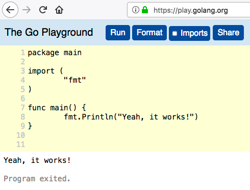

# A Violent Introduction to Go

No gentle introductions here! We jump right in with both feet. First I'll introduce you the Go playground where you can quickly write, compile and 
run Go code right in your browser. Then, I'll tell you what makes Go special, a little about Go's history, mention some prominent Go users, talk a bit about the community and finally introduce the sample application we will build together throughout the book (if you stick around). 
 
## Go playground

Let's start with some code. To make it super easy I'll show you the [Go playground](https://play.golang.org/), which is an online environment to compile and run Go code (A simple Go fiddle if you please). My version of "Hello World!" is called "Yeah, it works!". I'm always amazed when something related to computers actually works.

Here we go - a main package, importing the standard "fmt" package, a main function that prints our message to the screen.

```go
package main

import (
	"fmt"
)

func main() {
	fmt.Println("Yeah, it works!")
}
``` 

<!---
:
-->

The Go Playground runs on golang.org's servers. It is pretty spartan. There are other online Go environments if you want to experiment:

- https://www.tutorialspoint.com/execute_golang_online.php
- https://www.remoteinterview.io/online-go-compiler
- https://codebunk.com

## What Makes Go Special?

There are many programming languages. A handful are even successful. In this section I want to look at Go as a "programming language scientist" and explore what makes it special and a worthwhile language to learn and use..


### Simplicity

Simplicity is by far the most striking feature of Go. The trend in programming language design is to add more capabilities (C#), more features (C++), fancier type systems (Scala), advanced memory models (Rust), etc. Go is very refreshing because it takes the opposite approach. It explicitly avoids adding features and the prime directive is to keep the language simple and straightforward. Go feels like a 21st century C.

#### No Generics

Generics or templates are a mainstay of many programming languages. They often add complexity, and the error messages associated with generics can sometimes be obscure. Go designers decided to just skip it. 

This is arguably the most controversial design decision of Go. Personally, I find a lot of value in generics and believe that it can be done properly (see C# for a great example of generics done right). Hopefully, generics will be incorporated into Go in the future. 

#### No Exceptions

Go's error handling relies on explicit status codes. To separate status from the actual result of a function, Go supports multiple return values from a function. This is pretty unusual. I'll cover error handling in much more detail later in its own chapter, but here is a quick example:

```Go
package main
 
import (
  "fmt"
  "errors"
)
 
func div(a, b float64) (float64, error) {
  if b == 0 {
    return 0, errors.New(fmt.Sprintf("Can't divide %f by zero", a))
  }
  return a / b, nil  
}
 
 
func main() {
  result, err := div(8, 4)
  if err != nil {
    fmt.Println("Oh-oh, something went wrong. " + err.Error())
  } else {
    fmt.Println(result)
  }
   
  result, err = div(5, 0)
  if err != nil {
    fmt.Println("Oh-oh, something is wrong. "+ err.Error())
  } else {
    fmt.Println(result)
  }
}
 
Output:
	
2
Oh-oh, something is wrong. Can't divide 5.000000 by zero
```

#### Single Executable

Go has no separate runtime library. It generates a single executable, which you can deploy just by copying (a.k.a. XCOPY deployment). This is as simple as it gets. No need to worry about dependencies or version mismatches. It is also a great boon for container-based deployments (Docker, Kubernetes and friends). The single standalone executable makes for very simple Dockerfiles.   

#### No Dynamic Libraries (Until Go 1.8)

OK. This just changed recently in Go 1.8. You can now actually load dynamic libraries through the plugin package. But, since this capability wasn't introduced from the get go, I still consider it an extension for special situations. The spirit of Go is still a statically compiled executable. It is also available on Linux only at the moment.

### Opinionated

Go is as opinionated as they come: [Tabs over spaces](https://www.youtube.com/watch?v=SsoOG6ZeyUI), [One true brace style](https://en.wikipedia.org/wiki/Indentation_style#Variant:_1TBS_.28OTBS.29), forcing capitalization of public symbols, formatting code, you name it. Go even has a [code of conduct](https://golang.org/conduct). I think it's a good thing. Note that I don't say that because I like where Go lands on the issues. My personal preferences are very different - I prefer spaces over tabs, the [Allman brace style](https://en.wikipedia.org/wiki/Indentation_style#Allman_style) and the C#/Java modifiers for private/protected/internal. But, I can appreciate the benefits of a uniform mandated style. I have a lot of experience with Python where there is also an official style guide called [PEP-8](https://www.python.org/dev/peps/pep-0008/), but it is not enforced by the Python interpreter. As a result, while many responsible developers try to follow it, many others are unaware or don't care. With Go the compiler enforces the style and there can be no deviations.

### Tooling
 
Another pillar that makes Go special is its excellent tooling. The Go designers put a lot of emphasis on strong tooling from the get go. This is unusual as most language designers often focus on the core language and the tooling beyond the mandatory complier/interpreter often doesn't get as much attention. Some languages just throw the whole tooling effort on the community. I will dedicate a whole chapters to Go tools, but in brief Go comes with the `go` command that can do pretty much anything including running additional tools for a fully integrated and extensible story. Here some of those capabilities in no particular order:

- Show documentation for package or symbol
- Fix files that use old APIs
- Format Go source code
- Compie and Run Go programs
- Generate Go files by processing sources
- Run tests
- List packages
- Download and install packages
- Compile and install dependencies and packages

To see what additional tools are available just run `go tool`:

```Go
~ > go tool
addr2line
api
asm
cgo
compile
cover
dist
doc
fix
link
nm
objdump
pack
pprof
trace
vet
```   
  
### First Class Concurrency

One of the prime motivations for Go's design was adding concurrency support at the language level. Go concurrency is built on a model of [CSP](https://en.wikipedia.org/wiki/Communicating_sequential_processes). The language has Go routines (Go's flavor of coroutines), channels, synchronization primitives and garbage collection to ease memory management. I will of course dedicate a whole chapter to in depth coverage of all things concurrent. 


## Go Origins

Go has an interesting story with all the right ingredients. Let's see how and why Go came to life. 

### Go is from Google

Google writes a lot of code. Really a lot of code. The server code was mostly C++ with some Java and Python for various task. But, as the number of developers grew to the thousands and the amount of code grew to millions of lines the problems of managing and working so much code became more and more painful. For example, 10 years ago one of the big C++ binaries took 45 minutes to build. The story goes that during one of these 45 minute builds Go was conceived as the Go designers determined that the massive scale of Google requires a new programming language.

### Meet the Go Designers

The Go designers are [Ken Thompson](https://en.wikipedia.org/wiki/Ken_Thompson), [Rob Pike](https://en.wikipedia.org/wiki/Rob_Pike) and Robert Griesemer. The first two are software pioneers on the original Unix team at Bell Labs. Robert Griesemer wasn't as famous, but was always interested in programming language design and had 15 years of hands on C++ experience. Together they had a lot of knowledge and pretty good idea what you shouldn't do when designing a new language.

### Problems Go Tackles Head On 

Here are some of the problems that Go was designed to fix. Note that many of these problems are more in the periphery and not pure language issues.

- Build Time
- Dependency management
- Complex Languages lead to fractured usage (developers use different subsets)
- Codebase Understanding
- Accidental Complexity 
- Difficulty of writing Tools

This has been my experience too. After 22 years of programming professionally in many different programming languages (Go, C, C++, Python, Java, C#, Javascript). The language was never a barrier for productivity or the cause for bugs. It was much more often the ecosystem and the tooling around the language that caused the most friction.

### Inspiration for Go

The Go designers didn't start from a blank page. They were all experienced C++ "survivors" and they decided that their starting point will be a C-like language that is minimal yet modern. Right off the bat they made some major design decisions like using garbage collection, interfaces, methods with explicit receiver, packages and imports.

According to Robert Griesemer [Oberon](https://en.wikipedia.org/wiki/Oberon_(programming_language)) was also a major influence of the structure of Go.

The dependency management approach was taken from [Plan 9](https://en.wikipedia.org/wiki/Plan_9_from_Bell_Labs) C.

The concurrency support in Go originated from the theoretical underpinnings of C.A.R Hoare's [CSP](https://en.wikipedia.org/wiki/Communicating_sequential_processes) and Rob Pike's work on [Newsqueak](https://en.wikipedia.org/wiki/Newsqueak) at Bell Labs.

## Who Uses Go?

Go has been very successful over its 8 years. According to the Go blog it has more than half a million users. It is the number one language for building cloud infrastructure software: distributed systems, containers and container orchestration, data stores and data pipelines. Here are some of the major companies and open source projects that use Go:

- Google
- Docker
- Facebook
- General Electric
- Github
- Gitlab
- Helix (My company)
- IBM
- Kubernetes
- Microsoft
- MongoDb
- Mozilla
- OpenShift
- Percona
- SpaceX
- Stripe
- Twitter
- Uber

Here is a larger list of [Go users](https://github.com/golang/go/wiki/GoUsers)

In addition, lots of hobbyists and experienced programmers are attracted to the vision of a simple, easy to learn and high performance language with great concurrency support. In particular many Python developers and shops migrate to Go.

## The Go community

The Go community is exploding and quite welcoming. The average Go developer is a pragmatic engineer either young and eager to learn or experienced and still eager to learn. There aren't too many flame wars. People are focused on writing code, writing libraries and helping other people.
There are conferences and user groups. Overall, I feel the Go community is in a healthy state.

Go even has a [community outreach working group](https://blog.golang.org/community-outreach-working-group) and I mentioned earlier the [community code of conduct](https://golang.org/conduct).

## Delinkcious

Let's take a quick break from Go and talk about Delinkcios - our sample application. Dlinkcious is a [Delicious](https://en.wikipedia.org/wiki/Delicious_(website)) wannabe. If you've lived under a rock then Delicious is/was a successful link management service that exchanges hands a few times and is eventually purchased by Pinboard, which runs a similar service and intends to shutdown Delicious soon.

Anyway, Delinkcious will let users you store URLs to cool places on the web, tag them and then query them in various ways. Throughout the book I will use Delikcious as a platform to demonstrate many Go concepts and features in the content of a real-world application. 

## Summary

At this point you should have a pretty good idea what Go code looks like, you may even have played a little with the Go playground. You know that go is simple, opinionated, has great tooling and great concurrency support. You are awestruck by the immense software engineering problems Go can solve and you're starstruck by the fame of the Go designers: Ken Thompson, Rob Pike and Robert Griesemer. You understand how C, Oberon and Plan 9 inspired the design of Go. You're beginning to feel strong bonds to the Go community and you're itching to start working on Delinkcious. 
