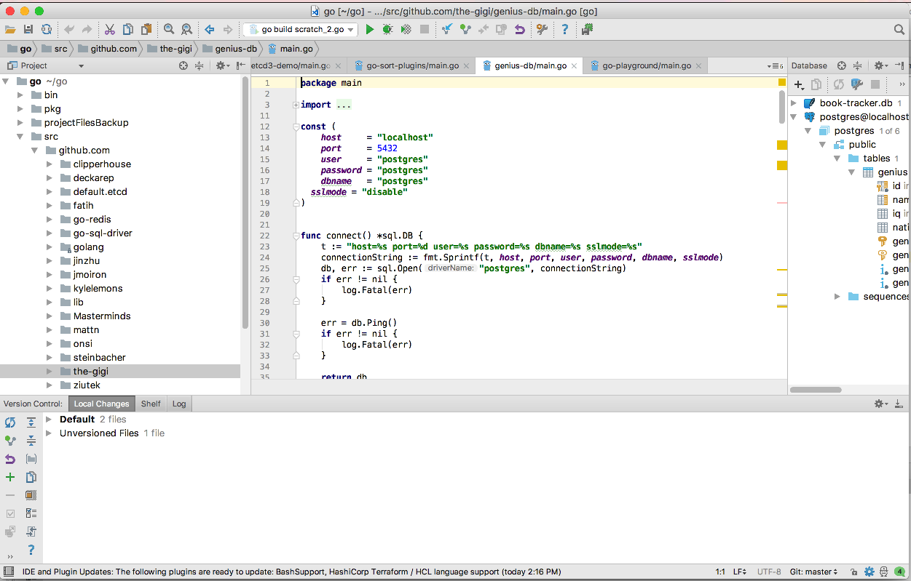
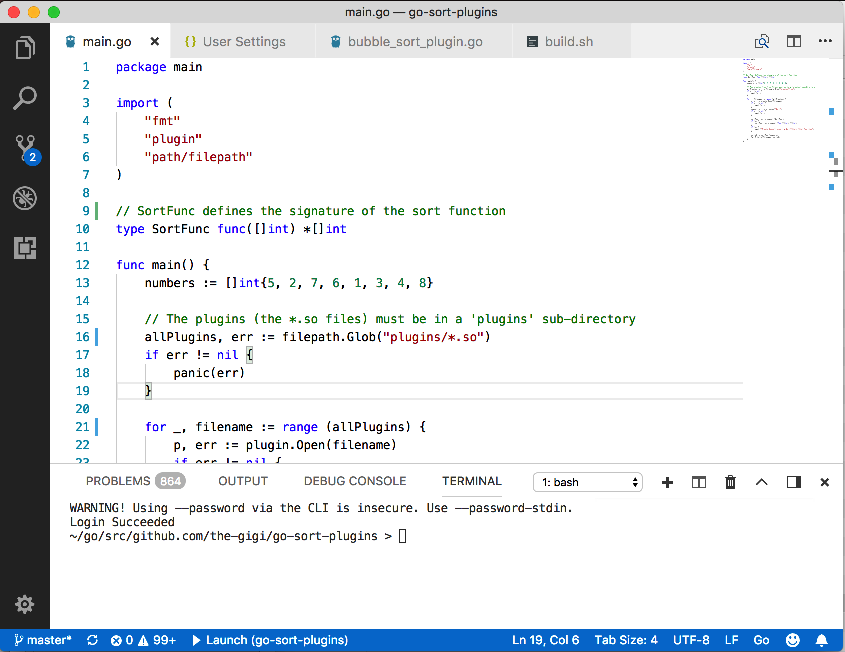
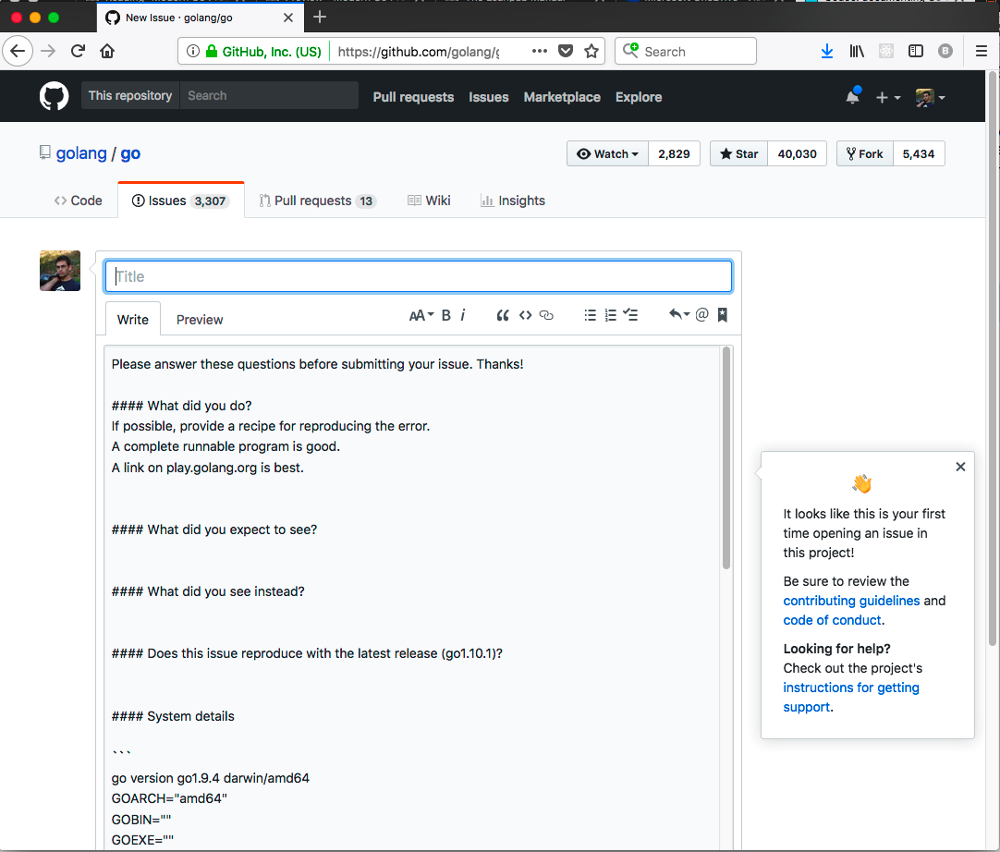

# Get Up and Running

In this chapter you'll get ready to roll. I'll discuss local installation on macOS and Windows, using a ready to go Docker image sporting a Linux distro, some IDEs you may like, the awsome tooling that comes with Go, how to organize your code and finally some troubleshooting and debugging advice. At the end of this chapter, you'll understand the options for local development and you'll have picked and set up at least one environment. You'll be ready to go!

## Installation

Go is cross-platform and can be installed on macOS (that's what they call Mac OSX these days), Linux and Windows. Just follow the instructions and you'll be fine: https://golang.org/doc/install

On Mac you may prefer to use [homebrew](https://brew.sh/). I do. This option is not mentioned in the docs. Just type: `brew install go`

That's all there is to it. To find out where Go is installed on your system type (Mac and Linux):

```
> ls -la `which go`
lrwxr-xr-x  1 gigi.sayfan  admin  23 Sep 19 16:44 /usr/local/bin/go -> ../Cellar/go/1.9/bin/go
```

If you're using Windows. It's probably "C:\go". You can find out for sure by opening a PowerShell window and using the Get-Command command:

```powershell
PS C:\Users\gigi> get-command go

CommandType     Name                                                Definition
-----------     ----                                                ----------
Application     go.exe                                              C:\Go\bin\go.exe
```

To verify everything is fine type `go` in a console window. You should see this:

```
> go
Go is a tool for managing Go source code.

Usage:

	go command [arguments]

The commands are:

	build       compile packages and dependencies
	clean       remove object files
	doc         show documentation for package or symbol
	env         print Go environment information
	bug         start a bug report
	fix         run go tool fix on packages
	fmt         run gofmt on package sources
	generate    generate Go files by processing source
	get         download and install packages and dependencies
	install     compile and install packages and dependencies
	list        list packages
	run         compile and run Go program
	test        test packages
	tool        run specified go tool
	version     print Go version
	vet         run go tool vet on packages

Use "go help [command]" for more information about a command.

Additional help topics:

	c           calling between Go and C
	buildmode   description of build modes
	filetype    file types
	gopath      GOPATH environment variable
	environment environment variables
	importpath  import path syntax
	packages    description of package lists
	testflag    description of testing flags
	testfunc    description of testing functions

Use "go help [topic]" for more information about that topic.
```

To make sure it really works let's run our little "Yeah, it works!" program. Save it to a file call `yeah.go`:

```go
package main

import (
	"fmt"
)

func main() {
	fmt.Println("Yeah, it works!")
}
```

Go can compile your programs with the `go build` command, but if you want to immediately run your program you can use the `go run` command that will compile and execute the program immediately.

```
> go run yeah.go
Yeah, it works!
```

## Go in a box (Complete Go environment in a Docker container)

If you're too lazy to click links, download files and type commands I got you. You can use a Docker image with Go pre-installed. Here is the fast way to go about it:

- Make sure [Docker](https://docs.docker.com/engine/installation/) is installed
- Use a pre-built Golang Docker image
- Launch the Docker image while mounting your source directory into the container
- Build or run your program.

Here is a one-liner that builds and runs the yeah.go program inside a docker container given you have Docker installed.

`docker run --rm -v "$PWD":/go/src/yeah -w /go/src/yeah golang:1.10 go run yeah.go`

Let's understand what's going on here by explaining each element:

- docker run - the docker command that executes commands inside docker containers
- -v "$PWD":/go/src/yeah - mounts the current directory on the host into the container at /go/src/yeah
- -w /go/src/yeah - set the working directory inside the container
- golang:1.10 - the Docker image to load (if not available locally it will be downloaded)
- go run yeah.go - the command to execute inside the container

The first time you run this command Docker will download the golang:1.10 image from the docker repository. The output should look like:

```
Unable to find image 'golang:1.10' locally
1.10: Pulling from library/golang
3e17c6eae66c: Pull complete
fdfb54153de7: Pull complete
a4ca6e73242a: Pull complete
93bd198d0a5f: Pull complete
2a43f474a764: Pull complete
e19893b2f35c: Pull complete
3b8a1a0cc426: Pull complete
85a9bedd68ab: Pull complete
Digest: sha256:57ef143775b37c6100d4be60ca0f9493e18c68cde3ea76c36a22f41857df11f4
Status: Downloaded newer image for golang:1.10
Yeah, it works!
```

But, running the command again will be much more concise:

```
> docker run --rm -v "$PWD":/go/src/yeah -w /go/src/yeah golang:1.10 go run yeah.go
Yeah, it works!
```

## Native Installation vs. Docker

There are pros and cons for each approach:

- Native installation is more streamlined
- Debugging native installation may be easier
- Running in disposable Docker containers makes it easy to run against multipel versions of Go
- Running in disposable Docker containers makes it easy to isoalte different environments without messing with environment variables
- Running in disposable Docker containers doesn't clutter your OS, file syste and environment variables
- Docker allows building a full-fledged environment for your application ready to be deployed

You may even use a hybrid approach where you run some programs natively and other in Docker containers.

Check out https://github.com/docker-library/docs/tree/master/golang for more options. 	

## Integrated Development Environments

I was always a big fan of IDEs. Early in my career, I used Microsoft's Visual Studio for C/C++ development as well as C#. I've used NetBeans for a short stint of Java development. I've used JetBrains' PyCharm for Python development for many years, and nowadays I use JetBrains Goland for Go development. But, Goland is not the only game in town. Visual Studio Code is a great Go IDE and has many followers. A lot of people just use text editors with various plugins. There are also several other IDEs that are less popular.

### Goland

Goland is the JetBrains Go IDE. It doesn't get any better IMO. Unfortunately, there is no community edition. So, if you want to use it you have to pay for it (or have your company pay for it). Goland has all the bells and whistles: 

- Project management
- Super-powerful code editor
- Lots of refactoring
- Go tools integrations
- Integrated testing including coverage
- Integrated debugging

But, it also has tons of other auxiliary features such as:

- Strong source control integration
- Built-in terminal
- Docker and vagrant integration
- Web development (HTML, CSS, Javascript)
- Database tools 
- Powerful git support
- Markdown support
- Lots of other plugins



### Visual Studio Code

I don't use [Visual Studio Code](https://code.visualstudio.com/) myself, but I know many people who swear by it. Since, Goland will cost you $$$ you may prefer Visual Studio Code as your Go IDE. What makes Visual Studio Code special? Here are a few tidbits:
- It is based on [Electron](https://en.wikipedia.org/wiki/Electron_(software_framework)), same as [Atom](https://en.wikipedia.org/wiki/Atom_(text_editor)), but it provides its own editor - [Monaco](https://github.com/Microsoft/monaco-editor)
- It was voted developer environment tool in the 2018 StackOverflow survey with 34% of the votes
- It was developed by Microsoft and released under the MIT license in 2015. The code is on [Github](https://github.com/Microsoft/vscode)



I> If you hold old-fashioned opinions about a monopolistic and proprietary Microsoft that spreads fear, uncertainty and doubt every which way, you may want to revise your views. Microsoft of late is an open source jaggernaut that contributes money and software to open source projects, develops its own core technologies in the open on github and interacts very actively with the open source community.   

### Your favorite text editor

As you know Go was designed by old Unix graybeards. They definitely don't require you to use a flashy IDE to program in Go. You can program Go just fine with a plain text editor, use the Go tools from any command-line terminal and not miss a beat. Popular editors like vim, emacs and sublime text have their own Go mods and plugins as well as dedicated fans that refuse to look at Go code in any other environment.

### Other Go IDEs

You can find a pretty comprehensive list of editors and other IDEs here:
https://github.com/golang/go/wiki/IDEsAndTextEditorPlugins

## Tooling

As I mentioned earlier one of the strongest points of Go is its tooling. 

### The Go Command

In partiuclar the Go command is your gateway to a lot of goodness. Here is the output if you just type: `go`:


    build       compile packages and dependencies
    clean       remove object files
    doc         show documentation for package or symbol
    env         print Go environment information
    bug         start a bug report
    fix         run go tool fix on packages
    fmt         run gofmt on package sources
    generate    generate Go files by processing source
    get         download and install packages and dependencies
    install     compile and install packages and dependencies
    list        list packages
    run         compile and run Go program
    test        test packages
    tool        run specified go tool
    version     print Go version
    vet         run go tool vet on packages	

    Use "go help [command]" for more information about a command.    

Some of these commands you will use on a regular basis and some of them are more specialized. The `go tool` sub-command is like an escape hatch that allows you to run other more specialized tools. I'll dive into the `go tool` in a separte section.  


#### Help

If you want the nitty-gritty details on a Go command - type `go help <command>`. The same information is available on the web here: https://golang.org/cmd/go/.

#### Build

Build is a bread and butter command. You use it to build your code and dependencies into libraries and/or programs. Let's see it in action and build this little program:

<<[tools_demo/main.go](code/chapter-2/src/tools_demo/main.go)

To test inside a Docker container on my local machine I change directory to the to chapter-2 code directory and then type

    docker run --rm -it -v "$PWD":/go -w /go/src/tools_demo golang:1.10 bash

This command will drop in a nice inteactive session with GOPATH set to `/go` and in the tools_demo working directory.

Inside the container, let's verify only the main.go source program is present

    root@b76610d4ea5c:/go/src/tools_demo# ls
    main.go
    
Then run the `go build` command and see that the tools_demo executable was built

    
    root@b76610d4ea5c:/go/src/tools_demo# go build
    root@b76610d4ea5c:/go/src/tools_demo# ls
    main.go  tools_demo
    
Finally, we can run the tools_demo program
    
    root@b76610d4ea5c:/go/src/tools_demo# ./tools_demo
    http://www.github.com is a valid url
    https://www.golang.org is a valid url
    blah://ftp.xyz.org is not a valid url

This was a very minimal demo of how build works. There are many flags an options, but the documentation does a pretty good job at explaining them, so there's no point to rpeat it here.

It's worth mentioning though that build relies on a standard Go directory structure that we will cover in detail later. If you follow a non-conventional structure for some reason (bad idea) then the build command will not work for you and you'll have to use lower level tools like `go tool compile` and `go tool link`.

#### Clean

Clean is very simple. It removes object and executable files from various directories. Go itself build most of these artifacts in temporary files, but the clean command can clean up remnants of other tools. Here is the list of directories and files:

	_obj/            old object directory, left from Makefiles
	_test/           old test directory, left from Makefiles
	_testmain.go     old gotest file, left from Makefiles
	test.out         old test log, left from Makefiles
	build.out        old test log, left from Makefiles
	*.[568ao]        object files, left from Makefiles

	DIR(.exe)        from go build
	DIR.test(.exe)   from go test -c
	MAINFILE(.exe)   from go build MAINFILE.go
	*.so             from SWIG


Clean can remove installed files too if you provide the `-i` flag. To see what fiels are going to be cleaned up you can run it with the `-n` flag:

    root@aa9372c02c02:/go/src/tools_demo# go clean -n
    cd /go/src/tools_demo
    rm -f tools_demo tools_demo.exe tools_demo.test tools_demo.test.exe main main.exe

#### Doc

Documentation in Go is very simple. You just write any comment above a package or a function and Go treats it like documentation. You should start the comment with the name of the entity being documented. There are very few other rules (e.g. urls are automatically converted to links). Here is an example:

<<[urlutil package](code/chapter-2/src/urlutil/urlutil.go)

The `go doc` command can display the documentation. If you're in the package directory you can just run it with no arguments

```
root@aa9372c02c02:/go/src/urlutil# go doc
package urlutil // import "urlutil"

Package urlutil contains utility functions to work with URLs

func IsReachable(url string) bool
func IsValidUrl(url string) bool
```

As you can see only the the function signatures show up. The function comments are omitted. This is
pretty annoying. You can see individual function comments by specifiyng the function name: 

```
root@b76610d4ea5c:/go/src/tools_demo# go doc urlutil.IsReachable
func IsReachable(url string) bool
    Try to get the headers from the target url.

    See: https://developer.mozilla.org/en-US/docs/Web/HTTP/Methods/HEAD
```

Note that main packages (commands) require a special flag: `-cmd` if you want to display their documentation.

There is also a `godoc` binary, which includes a web server and can serve locally the contents of godoc.org as well as your own package documentation.

`godoc` can disply all function comments:

```
root@75aeb02ab0fb:/go/src/urlutil# godoc .
PACKAGE DOCUMENTATION

package urlutil
    import "."

    Utility functions to works with URLs

FUNCTIONS

func IsReachable(url string) bool
    Try to get the headers from the target url.

    See: https://developer.mozilla.org/en-US/docs/Web/HTTP/Methods/HEAD

func IsValidUrl(url string) bool
    Check if a url starts with http:// or https://
```

#### Env

This simple command just displays various environment variables used by Go. Most of the time you 
should only care about GOPATH (which I'll cover in detail).

```
root@75aeb02ab0fb:/go/src/urlutil# go env
GOARCH="amd64"
GOBIN=""
GOCACHE="/root/.cache/go-build"
GOEXE=""
GOHOSTARCH="amd64"
GOHOSTOS="linux"
GOOS="linux"
GOPATH="/go"
GORACE=""
GOROOT="/usr/local/go"
GOTMPDIR=""
GOTOOLDIR="/usr/local/go/pkg/tool/linux_amd64"
GCCGO="gccgo"
CC="gcc"
CXX="g++"
CGO_ENABLED="1"
CGO_CFLAGS="-g -O2"
CGO_CPPFLAGS=""
CGO_CXXFLAGS="-g -O2"
CGO_FFLAGS="-g -O2"
CGO_LDFLAGS="-g -O2"
PKG_CONFIG="pkg-config"
GOGCCFLAGS="-fPIC -m64 -pthread -fmessage-length=0 -fdebug-prefix-map=/tmp/go-build486510450=/tmp/go-build -gno-record-gcc-switches"
```

If you want to know more about these environment variables type: `go help environment`.

#### Bug

The `go bug` let's you report bugs to the Go team. It opens your browser on Github with a bug report template that includes your Go environment (remember the `go env` command?).



Go at version 1.10 is pretty robust. I recommend that you ask around and verify you actually found 
a bug before reporting.

#### Fix

The `go fix` command is pretty cool. It helps upgrading your code when a new version of Go updates 
some package API. Go fix really embodies the tooling focus of the Go team. It relies on a strong tooling base of parsing Go source files into abstract syntax trees. This capability allows the Go designers a larger degree of freedom to make breaking changes if they know that `go fix` can automatically convert user's code to the new API. It was a life-saver pre 1.0.

#### Fmt

Formatting is a big deal for many people. So many flame wars started over where to place your curly braces and how to align your code. Check out this awesome segment from Silicon Valley about [tabs vs. spaces](https://www.youtube.com/watch?v=SsoOG6ZeyUI). Go puts a stop to it. There is standard formatting and there is a tool to format your code for you. In particular Go chose tabs over spaces, so Richard Hendrix won :-).

Let's see `go fmt` in action. But, it's not omnipotent. The following code for example produces an error:

``` go
package fmt_fail_demo
import  "fmt"

func Foo()
{
  fmt.Println("foo")
}
```

Go fmt can't handle the curly brace in a new line after `func Foo()`. Here is what happens:

```
root@d644ee323750:/go/src/fmt_fail_demo# go fmt
fmt_demo_bad.go:5:1: expected declaration, found '{'
exit status 2
``` 

Note that Goland can handle this particular formatting issue.

OK. Let's see how `go fmt` works with valid Go code. Running `go fmt` on this code:

``` go
package fmt_demo
import "fmt"
func Foo() {
  fmt.Println( 2 - 4 / 3 * 5  )
}
```

Produces the following code with proper spacing between lines and in the paramaters to `fmt.Println()`:

``` go
package fmt_demo

import "fmt"

func Foo() {
	fmt.Println(2 - 4/3*5)
}
```

#### Generate

The `go generate` command is designed to help with code generation. I'm a big fan of code generation and we'll do some hard-core code generation later in the book. But, I don't like `go generate`. It's false advertising. It doesn't generate anything! All it does is run an arbitrary command. Sure, you can use this command to generate code or do anything at all, but you'll have to remember to call `go generate` yourself (or add it to your build process). How does it work? You write a special comment in a Go file that can run any shell command whatsoever. Then, you run `go generate` and the command executes. That's it. If you actually want to generate code then you need to define your own templates, scan them, populate them with replacements values, etc. Instead of embedding the command that starts the whole process in a Go file that contains a special comment you can just call your comand directly in your build script.  

Here is a quick example, where the command just print a greeting to the screen:

```
package generate_demo

//go:generate echo "Hi there"
```

This is how you "execute it"

```
root@0339408136b2:/go/src/generate_demo# go generate
Hi there
```

As you can see there is connection between the file that contains the `go:generate` comment and the command that is running. If you actually generate some new code you'll have to take of naming the generated files properly and make sure you don't confuse templates files, files that contain `go:generate` comments, but can also contain normal Go code and generated source files. I really don't see the value of `go:generate`.


#### Install

Go install builds your packages and copy them to the proper target. Regular packages go to $GOPATH/pkg and executables/commands (main packages) go to $GOPATH/bin.

Here is how to install the tools_demo program and run it directly:

```
root@ce1c4654606d:/go/src/tools_demo# go install .
root@ce1c4654606d:/go/src/tools_demo# ls /go/bin
tools_demo
root@ce1c4654606d:/go/src/tools_demo# tools_demo
http://www.github.com is a valid url
http://www.github.com is not reachable
https://www.no-such-url-really.org is a valid url
https://www.no-such-url-really.org is not reachable
blah://ftp.xyz.org is not a valid url
blah://ftp.xyz.org is not reachable
```


Once it's installed I just type `tools_demo` to run it because $GOPATH/bin in on my path.

#### Get

Enough ranting about `go generate`. The `go get` is super useful. This is how you install 3rd party libraries and commands into your Go environment. It's the equivalent of Python's `pip install`, Rust's `cargo install` and Ruby's `gem install`.
It downloads the target package or command and installs it. For example, if I want to install one of my projects on github called multi-git I can type: `go get github.com/the-gigi/multi-git`. The project will be downloaded into the src directory and the executable installed into the bin directory. Here are the results: 

```
root@0339408136b2:/go/src# tree github.com
github.com
`-- the-gigi
    `-- multi-git
        |-- LICENSE
        |-- README.md
        `-- main.go

2 directories, 3 files

root@0339408136b2:/go/src# cd ../bin
root@0339408136b2:/go/bin# ls
multi-git 
```
The multi-git program lets you perform git operations on multiple repos at the same time. If you're interested check out the README: https://github.com/the-gigi/multi-git/blob/master/README.md

Don't forget to define `MG_ROOT` and `MG_REPOS`!

#### Test

The `go test` command runs your tests. We have a massive chapter coming on testing, so I will not waste words here.

#### Version

The `go version` command simply prints the version of Go

```
root@0c60b4741c71:/go/src/tools_demo# go version
go version go1.10 linux/amd64
```

#### Vet

The vet command checks your code and finds various mistakes that are not compilation errors. The generated code is valid, but probably doesn't do what you intended. Here is an example of unreachable code that `go vet` finds and reports.

<<(code/chapter-2/src/vet_demo/vet_demo.go)

```
root@0c60b4741c71:/go/src/vet_demo# go vet
# vet_demo
./vet_demo.go:9: unreachable code
```

### The Go Tool Command

The go tool is a collection of less-used commands. You invoke them as `go tool <commands>`. Many of them are very low-level. Some of the more high-level commands like `doc`, `fix` and `vet` have been "promoted" and you can invoke them directly as "go <command>". I already discussed these commands. To see the documentation for a go tool command you use the standard go doc. 


A> Note that while you need to add `tool` when invoking go tool commands, you don't need to mention tool when accessing the documentation. For example, you invoke the addr2line with `go tool addr2line`, but access the documentation with just `go doc addr2line`    

#### Addr2line

This super low-level command is intended to be used only by pprof (the Go profiler). You shouldn't 
really use it under any circumstances. It takes a Go binary and an address and returns the function name, filename and line. Here is a quick example:

```
root@20a323dd2045:/go# echo 500000 | go tool addr2line tools_demo
crypto/elliptic.p256OrdSqr
/usr/local/go/src/crypto/elliptic/p256_asm_amd64.s:1134
``` 

#### Asm

This is the Go assembler. Again, super low-level and outside the scope of the book. If you want to know more check out the [Quick Guide to Go's Assembler](https://golang.org/doc/asm).

#### Cgo

The cgo command lets your Go code interact with C code. If you want to learn more check out https://golang.org/cmd/cgo/

#### Compile and Link

The compile and link commands can be used to build Go code in non-standard directory structure. The `go build` command follows some conventions. If you're a few spirit or need for some reason more fine-grained control on where your source files are located and where to put the artifacts then you can use compile and link.

The compile command can generate object files or archives and even assembly code
  
#### Cover

The cover command is use for test coverage. I'll cover the cover command (see what I did there?) in detail in [Industrial-Strength Testing in Go](#chapter-industrial-strength-testing)

#### Dist

The dist command can helps with verfying and testing the Go distribution itself. It has several sub-commands:

```
root@04eae1841051:~# go tool dist
usage: go tool dist [command]
Commands are:

banner         print installation banner
bootstrap      rebuild everything
clean          deletes all built files
env [-p]       print environment (-p: include $PATH)
install [dir]  install individual directory
list [-json]   list all supported platforms
test [-h]      run Go test(s)
version        print Go version

All commands take -v flags to emit extra information.
```

There's is not reason for you to mess around with it.

#### Nm

The nm command was indespensible in my C++ days when I had various build and link issues due to missing symbols. It can tell you about symbols defined, used and most improtantly missing from an object file, archive or executable. I don't anticipate you'll have much use for nm if you just write Go without mixing in other languages.

#### Objdump

The objdump command disassembles Go binaries. It can display the source too if you add the -S flag. If the -s (lowercase) flag is provided the it will display only symbols matching the regular expression following -s. Here is some of the output of the following command: `# go tool objdump -S -s main tools_demo`

```
	for _, url := range urls {
  0x5ec174		488b442458		MOVQ 0x58(SP), AX
  0x5ec179		488d4810		LEAQ 0x10(AX), CX
  0x5ec17d		488b442448		MOVQ 0x48(SP), AX
  0x5ec182		48ffc0			INCQ AX
  0x5ec185		4883f803		CMPQ $0x3, AX
  0x5ec189		0f8df4010000		JGE 0x5ec383
  0x5ec18f		4889442448		MOVQ AX, 0x48(SP)
  0x5ec194		48894c2458		MOVQ CX, 0x58(SP)
  0x5ec199		488b5108		MOVQ 0x8(CX), DX
  0x5ec19d		4889542440		MOVQ DX, 0x40(SP)
  0x5ec1a2		488b19			MOVQ 0(CX), BX
  0x5ec1a5		48895c2450		MOVQ BX, 0x50(SP)
	return len(s) >= len(prefix) && s[0:len(prefix)] == prefix
  0x5ec1aa		4883fa07		CMPQ $0x7, DX
  0x5ec1ae		0f8d93010000		JGE 0x5ec347
  0x5ec1b4		31f6			XORL SI, SI
  0x5ec1b6		4084f6			TESTL SI, SI
``` 

#### Pack

The pack command is a simpler version of the Unix ar, used to package object files into archives. There is no reason you should ever use it. It's part of the low-level build tooling.

#### Pprof

The pprof command is used to profile your Go program. I dedicate a whole chapter to [profiling Go programs](#chapter-profiling-go-programs).

#### Trace

The trace command can visualize what's going on with your program at a very fine-grained level. I will cover it in detail in [profiling Go programs](#chapter-profiling-go-programs).

### The x/tools

The [x/tools](https://godoc.org/golang.org/x/tools) are an additional set of tools that you need to install and provide
additional useful capabilities. I'll mention a few I find especially beneficial, but feel free to explore all of them.

The repo is https://github.com/golang/tools/. Installation is as simple as `go get -u golang.org/x/tools/...`

Some of these tools like `godoc` and `vet` are already included in Go distributions and I covered them earlier, so don't be surprised.

### Go Imports

Go imports scans your code, formats it properly like `go fmt` and also adds and removes imports (hence the name
`go imports`). You can use it in a couple of situations:

- Integrate it with your favorite editor if it's not integrated already
- On your build and continuous integration server to fix issues with committed code
- On each developer machine in a pre-commit hook
- Ad-hoc when you look into random Go code that is not formatted properly.

For goland, you may want to add a file watcher to run `go imports` automatically. Since, go imports does everything `gofmt` does and fixes your imports I highly recommend to use it instead of gofmt.


### Guru

The guru tool is designed for integration with editors and IDEs, but it can be useful if you want to dive deep into your
code or get familiar with any large Go code base. It can answer questions like:

- Where is this identifier declared?
- Where are all the references to this declaration?
- What are the fields and methods of this this expression?
- What is the API of this package?
- Which concrete types implement this interface?
- What are the possible callees of this dynamic call?
- What are the possible callers of this function?
- Where might a value sent on this channel be received?

Check out [Using Go Guru](https://docs.google.com/document/d/1_Y9xCEMj5S-7rv2ooHpZNH15JgRT5iM742gJkw5LtmQ/edit#) for more information

### Cover

The [cover](https://blog.golang.org/cover) tool provides a view of your test coverage. I will explore it further when discussing testing at large.
But, in a few words test coverage means how much of your code is really covered by your tests. If your tests cover only 80% of your code then you might have bugs you don't know about in the 20% that is not tested.

### Go Returns

You don't have to limit yourself to standard tools of course. Go's tooling foucs means it is easier to write language-level tools. One such popular tool is [goreturns](https://github.com/sqs/goreturns). This tool calls `goimports` and then fixes your return statements by adding zero values for missing returns. This is can be especailly useful in combination with Go's explict error handling. It is very common to return a result and an error. When error occurs you typically return the zero value for the actual result and an error. With goreturns you can just return an error and it will take care of the rest. Here is a quick example:

```
```


### Other Stuff

There is also some random junk that doesn't really belong in a small language like Go. For example, there is a whole set of packages for writing and serving presentations, articles and blogs with its own special file format. I have no idea why it's here, but if you're curious you can check it out:

- [blog](https://godoc.org/golang.org/x/tools/blog)
- [html2article](https://godoc.org/golang.org/x/tools/cmd/html2article)
- [https://godoc.org/golang.org/x/tools/cmd/present]

	
## Organizing your Go Code

One of the things that baffled me when I started to learn Go was how to organize my code. One file programs are easy. But, once you start working with multiple packages and throw in some third party dependencies things become much more complicated.

		
## Troubleshooting and Debugging

OK. This is not a comprehensive troubleshooting guide. Whole books have been written on the subject. We will  

### Low Tech
 
### Gogland Debugger 

### Delve

### Logging

## Conclusion

Go was designed with tooling, programmer and team productivity in mind. It shows. The Go experience is very smooth and uniform compared to other languages like Python and Ruby that started as little scripting languages and grew in fits and starts to accommodate the needs of large scale software development (or dare I say engineering). It's also enlightening to compare the uniformity of the Go ecosystem to the wild west of Javascript. Let's hope it stays this way (for Go). In areas like code organization that didn't have a lot of guidance from the desgin tean the community quickly came up with best practices.


